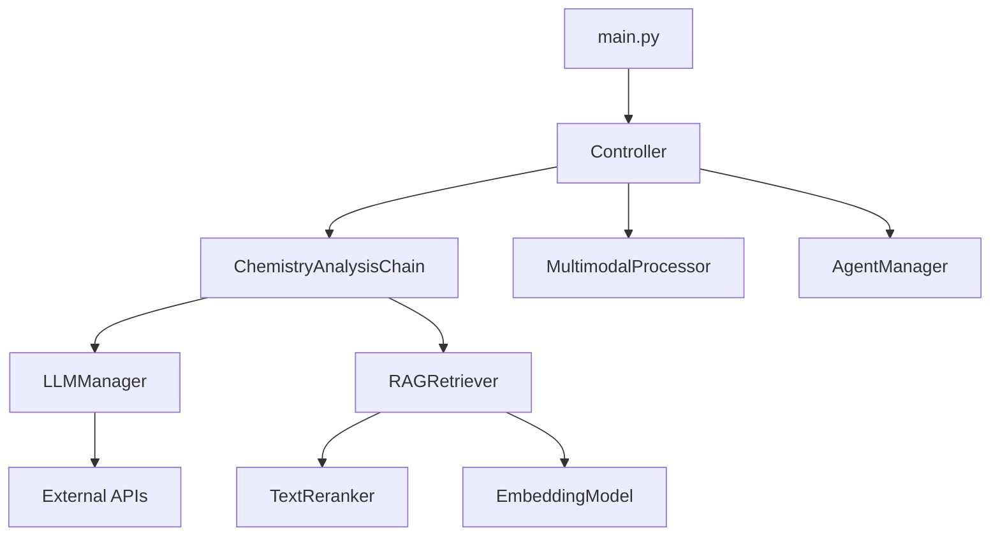

# 化学助手开发指南

## 📋 目录

1. [开发环境设置](#开发环境设置)
2. [项目架构详解](#项目架构详解)
3. [核心模块开发](#核心模块开发)
4. [新功能开发流程](#新功能开发流程)
5. [测试和调试](#测试和调试)
6. [部署和发布](#部署和发布)
7. [最佳实践](#最佳实践)
8. [常见问题解决](#常见问题解决)

## 🛠️ 开发环境设置

### 1. 环境要求

```bash
# Python版本
Python 3.8+

# 系统要求
内存: 8GB+ (推荐16GB)
存储: 10GB+ (包含模型和数据)
CPU: 4核+ (推荐8核)
```

### 2. 项目克隆和设置

```bash
# 进入项目目录
cd c:\Users\xiangteng\Desktop\project\chemistry-assistant

# 安装依赖
pip install -r requirements.txt

# 设置环境变量(解决OpenMP冲突)
set KMP_DUPLICATE_LIB_OK=TRUE
```

### 3. API密钥配置

在 `config.py` 中配置必要的API密钥:

```python
MODEL_CONFIG = {
    'tongyi': {
        'api_key': 'your-dashscope-api-key',
        'model': 'qwen-max',
    },
    'zhipu': {
        'api_key': 'your-zhipu-api-key',
        'model': 'glm-4',
    },
    # 其他模型配置...
}
```

### 4. 开发工具推荐

- **IDE**: PyCharm, VSCode
- **调试**: Python Debugger, logging
- **测试**: pytest, unittest
- **代码质量**: flake8, black
- **版本控制**: Git

## 🏗️ 项目架构详解

### 1. 分层架构

```
用户界面层 (UI Layer)
    ↓
控制层 (Control Layer)
    ↓
业务逻辑层 (Business Logic Layer)
    ↓
数据访问层 (Data Access Layer)
    ↓
外部服务层 (External Services Layer)
```

### 2. 核心组件关系



### 3. 数据流

```
用户输入 → 控制器 → 任务路由 → 具体Agent → 模型调用 → 结果处理 → 用户输出
```

## 🔧 核心模块开发

### 1. 添加新的LLM模型

#### 步骤1: 在config.py中添加配置

```python
MODEL_CONFIG = {
    'new_model': {
        'api_key': 'your-api-key',
        'model': 'model-name',
        'api_base': 'https://api.example.com',
    }
}
```

#### 步骤2: 在LLMManager中添加初始化

```python
# core/llm_manager.py
def _initialize_models(self):
    # 添加新模型初始化
    if 'new_model' in MODEL_CONFIG and MODEL_CONFIG['new_model'].get('api_key'):
        self.models['new_model'] = YourNewModelClass(
            api_key=MODEL_CONFIG['new_model']['api_key'],
            model=MODEL_CONFIG['new_model'].get('model'),
            # 其他参数...
        )
        self.logger.info("新模型初始化成功")
```

#### 步骤3: 在ChemistryAnalysisChain中添加支持

```python
# core/chemistry_chain.py
def _parallel_model_call(self, question: str):
    # 添加新模型到并行调用列表
    models_to_call = ['qwen3', 'deepseek', 'new_model']
    # 其他逻辑...
```

### 2. 添加新的检索源

#### 步骤1: 扩展RAGRetriever

```python
# tools/rag_retriever.py
class RAGRetriever:
    def __init__(self):
        # 添加新的数据源
        self.new_source_path = KNOWLEDGE_CONFIG['new_source_path']
        self.new_source_db = self._load_vector_store('new_source')
    
    def retrieve_from_new_source(self, query, k=5):
        """从新数据源检索"""
        if not self.new_source_db:
            return []
        
        docs = self.new_source_db.similarity_search(query, k=k)
        return docs
```

#### 步骤2: 更新综合检索方法

```python
def retrieve_comprehensive(self, query, textbook_k=3, question_k=2, new_source_k=2):
    """综合检索，包含新数据源"""
    all_docs = []
    
    # 现有检索
    textbook_docs = self.retrieve_from_textbooks(query, k=textbook_k)
    question_docs = self.retrieve_from_questions(query, k=question_k)
    
    # 新数据源检索
    new_source_docs = self.retrieve_from_new_source(query, k=new_source_k)
    
    all_docs.extend(textbook_docs)
    all_docs.extend(question_docs)
    all_docs.extend(new_source_docs)
    
    # 排序和返回
    if self.use_reranker and self.text_reranker.is_available():
        return self.text_reranker.rerank_langchain_docs(query, all_docs)
    
    return all_docs
```

### 3. 添加新的化学工具

#### 步骤1: 在ChemistrySolver中添加方法

```python
# tools/chemistry_solver.py
class ChemistrySolver:
    def new_calculation_method(self, input_data):
        """新的化学计算方法"""
        try:
            # 实现计算逻辑
            result = self._perform_calculation(input_data)
            return {
                'success': True,
                'result': result,
                'explanation': '计算说明'
            }
        except Exception as e:
            return {
                'success': False,
                'error': str(e)
            }
```

#### 步骤2: 在ToolsAgent中集成

```python
# agents/tools_agent.py
class ToolsAgent:
    def process_request(self, request_type, data):
        if request_type == 'new_calculation':
            return self.chemistry_solver.new_calculation_method(data)
        # 其他处理逻辑...
```

## 🔄 新功能开发流程

### 1. 需求分析

1. **功能定义**: 明确功能目标和用户需求
2. **技术评估**: 评估技术可行性和资源需求
3. **架构设计**: 设计功能架构和接口
4. **开发计划**: 制定开发时间表和里程碑

### 2. 开发步骤

```bash
# 1. 创建功能分支
git checkout -b feature/new-feature

# 2. 实现核心逻辑
# 编写核心功能代码

# 3. 添加测试
# 编写单元测试和集成测试

# 4. 更新文档
# 更新相关文档和使用说明

# 5. 代码审查
# 进行代码审查和质量检查

# 6. 合并主分支
git merge feature/new-feature
```

### 3. 代码规范

#### Python代码风格

```python
# 文件头部注释
#!/usr/bin/env python
# -*- coding: utf-8 -*-

"""
模块说明
详细描述模块功能和用途
"""

# 导入顺序
import os  # 标准库
import sys

import numpy as np  # 第三方库
import pandas as pd

from config import MODEL_CONFIG  # 本地模块
from utils.logger import get_logger

# 类定义
class ExampleClass:
    """
    类说明
    
    Attributes:
        attribute1 (str): 属性说明
        attribute2 (int): 属性说明
    """
    
    def __init__(self, param1: str, param2: int = 0):
        """
        初始化方法
        
        Args:
            param1 (str): 参数说明
            param2 (int, optional): 参数说明. Defaults to 0.
        """
        self.attribute1 = param1
        self.attribute2 = param2
    
    def example_method(self, input_data: dict) -> dict:
        """
        方法说明
        
        Args:
            input_data (dict): 输入数据说明
        
        Returns:
            dict: 返回数据说明
        
        Raises:
            ValueError: 异常说明
        """
        try:
            # 实现逻辑
            result = self._process_data(input_data)
            return {'success': True, 'data': result}
        except Exception as e:
            logger.error(f"处理失败: {e}")
            return {'success': False, 'error': str(e)}
```

#### 错误处理模式

```python
# 统一错误处理
def safe_operation(self, data):
    """安全操作模式"""
    try:
        # 主要逻辑
        result = self._main_logic(data)
        return {'success': True, 'result': result}
    except SpecificException as e:
        # 特定异常处理
        self.logger.warning(f"特定错误: {e}")
        return {'success': False, 'error': 'specific_error', 'message': str(e)}
    except Exception as e:
        # 通用异常处理
        self.logger.error(f"未知错误: {e}")
        return {'success': False, 'error': 'unknown_error', 'message': str(e)}
```

## 🧪 测试和调试

### 1. 测试策略

#### 单元测试

```python
# test_example.py
import unittest
from unittest.mock import Mock, patch

class TestExampleClass(unittest.TestCase):
    def setUp(self):
        """测试前置设置"""
        self.example = ExampleClass('test', 1)
    
    def test_example_method(self):
        """测试示例方法"""
        input_data = {'key': 'value'}
        result = self.example.example_method(input_data)
        
        self.assertTrue(result['success'])
        self.assertIn('data', result)
    
    @patch('module.external_api_call')
    def test_with_mock(self, mock_api):
        """使用Mock的测试"""
        mock_api.return_value = {'status': 'success'}
        
        result = self.example.method_with_api_call()
        
        self.assertTrue(result['success'])
        mock_api.assert_called_once()

if __name__ == '__main__':
    unittest.main()
```

#### 集成测试

```python
# test_integration.py
def test_full_workflow():
    """测试完整工作流"""
    # 初始化组件
    controller = Controller()
    
    # 测试输入
    test_query = "什么是化学键？"
    
    # 执行测试
    result = controller.process_query(test_query)
    
    # 验证结果
    assert result is not None
    assert 'answer' in result
    assert len(result['answer']) > 0
```

### 2. 调试技巧

#### 日志调试

```python
# 使用结构化日志
logger.info("开始处理查询", extra={
    'query': query,
    'user_id': user_id,
    'timestamp': datetime.now().isoformat()
})

# 性能监控
import time
start_time = time.time()
# 执行操作
end_time = time.time()
logger.info(f"操作耗时: {end_time - start_time:.2f}秒")
```

#### 断点调试

```python
# 使用pdb调试
import pdb
pdb.set_trace()  # 设置断点

# 使用ipdb (推荐)
import ipdb
ipdb.set_trace()  # 更友好的调试界面
```

### 3. 性能测试

```python
# 性能测试示例
import time
import statistics

def performance_test():
    """性能测试"""
    times = []
    
    for i in range(10):
        start = time.time()
        # 执行被测试的操作
        result = controller.process_query("测试查询")
        end = time.time()
        
        times.append(end - start)
    
    print(f"平均响应时间: {statistics.mean(times):.2f}秒")
    print(f"最大响应时间: {max(times):.2f}秒")
    print(f"最小响应时间: {min(times):.2f}秒")
```

## 🚀 部署和发布

### 1. 本地部署

```bash
# 启动Web服务
python main.py --mode web

# 启动CLI模式
python main.py --mode cli

# 禁用排序器模式
python main.py --disable-reranker
```

### 2. Docker部署 (待实现)

```dockerfile
# Dockerfile
FROM python:3.9-slim

WORKDIR /app

COPY requirements.txt .
RUN pip install -r requirements.txt

COPY . .

EXPOSE 7860

CMD ["python", "main.py", "--mode", "web"]
```

### 3. 云端部署 (待实现)

```yaml
# docker-compose.yml
version: '3.8'
services:
  chemistry-assistant:
    build: .
    ports:
      - "7860:7860"
    environment:
      - TONGYI_API_KEY=${TONGYI_API_KEY}
      - ZHIPU_API_KEY=${ZHIPU_API_KEY}
    volumes:
      - ./data:/app/data
```

## 💡 最佳实践

### 1. 代码组织

- **单一职责**: 每个类和方法只负责一个功能
- **松耦合**: 模块间依赖最小化
- **高内聚**: 相关功能组织在一起
- **可扩展**: 设计支持未来扩展

### 2. 错误处理

- **优雅降级**: 功能不可用时提供备选方案
- **详细日志**: 记录足够的调试信息
- **用户友好**: 向用户提供清晰的错误信息
- **快速恢复**: 支持自动重试和恢复

### 3. 性能优化

- **缓存策略**: 缓存频繁访问的数据
- **异步处理**: 使用异步操作提高并发
- **资源管理**: 及时释放不需要的资源
- **批量处理**: 合并相似的操作

### 4. 安全考虑

- **API密钥保护**: 不在代码中硬编码密钥
- **输入验证**: 验证所有用户输入
- **权限控制**: 实现适当的访问控制
- **数据加密**: 敏感数据加密存储

## 🔧 常见问题解决

### 1. OpenMP库冲突

**问题**: `OMP: Error #15: Initializing libiomp5md.dll, but found libiomp5md.dll already initialized.`

**解决方案**:
```bash
set KMP_DUPLICATE_LIB_OK=TRUE
```

### 2. API调用失败

**问题**: 模型API调用返回错误

**解决方案**:
1. 检查API密钥是否正确
2. 检查网络连接
3. 查看API配额和限制
4. 启用自动降级机制

### 3. 内存不足

**问题**: 处理大量数据时内存溢出

**解决方案**:
1. 实现批量处理
2. 优化数据结构
3. 及时释放不需要的对象
4. 使用生成器代替列表

### 4. 检索精度低

**问题**: RAG检索结果不准确

**解决方案**:
1. 优化嵌入模型
2. 调整检索参数
3. 启用文本排序器
4. 改进数据预处理

### 5. 响应速度慢

**问题**: 系统响应时间过长

**解决方案**:
1. 启用并行处理
2. 实现结果缓存
3. 优化模型选择
4. 减少不必要的计算

## 📚 参考资源

### 技术文档
- [LangChain官方文档](https://python.langchain.com/)
- [DashScope API文档](https://help.aliyun.com/zh/dashscope/)
- [Gradio文档](https://gradio.app/docs/)
- [FAISS文档](https://faiss.ai/)

### 开发工具
- [PyCharm IDE](https://www.jetbrains.com/pycharm/)
- [Visual Studio Code](https://code.visualstudio.com/)
- [Git版本控制](https://git-scm.com/)
- [Docker容器化](https://www.docker.com/)

### 学习资源
- [Python官方文档](https://docs.python.org/3/)
- [机器学习实战](https://github.com/apachecn/MachineLearning)
- [深度学习框架](https://pytorch.org/)
- [自然语言处理](https://huggingface.co/)

---

**最后更新**: 2024年12月  
**维护者**: Chemistry Assistant Development Team

*本指南将随着项目发展持续更新，欢迎贡献改进建议。*